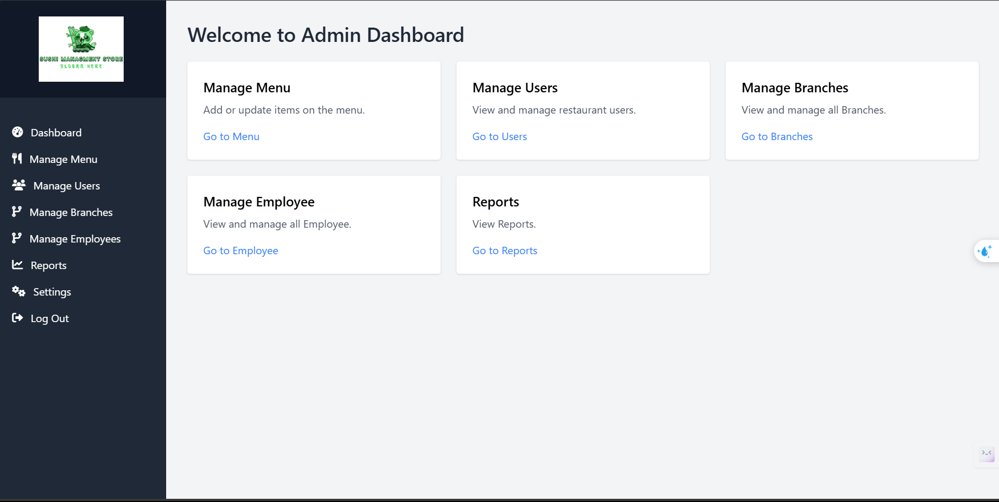
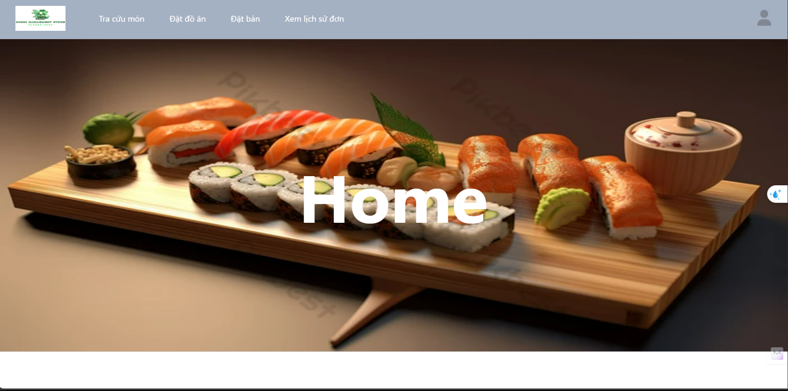
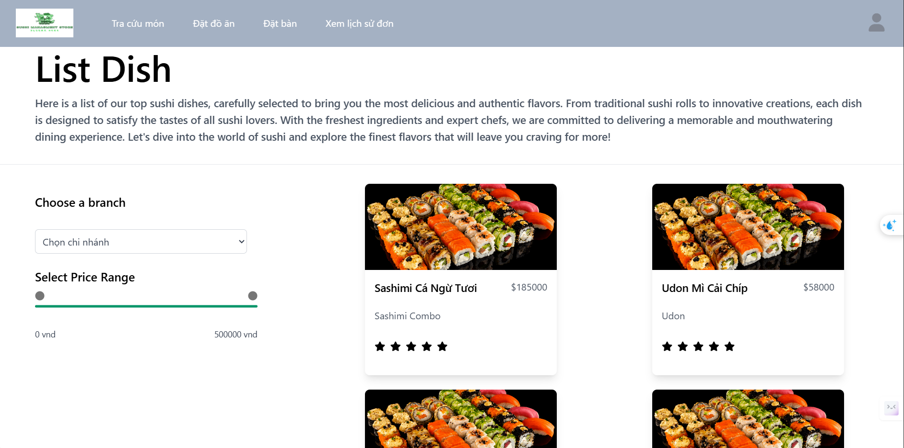

# 🍣 SushiStore Management

## 📌 Overview
SushiStore Management is a restaurant management application designed to optimize the ordering process, menu management, employee tracking, and customer interactions. The system supports server-side rendering using the MVC model for optimal performance and a smooth user experience.

---

## 🛠️ Tech Stack

### **Backend**
-  - Server runtime
-  - API framework
-  - Database management
-  - Server-side rendering

### **Frontend**
-  - Markup language
-  - Styling
-  - Client-side scripting
-  - Utility-first CSS framework

### **Architecture**
- MVC (Model-View-Controller) pattern
- Server-side rendering for speed and security optimization

---

## 🚀 How to Use
### 1️⃣ **Setup Environment**
Requirements: Node.js and SQL Server must be installed.
```bash
# Clone repository
git clone https://github.com/your-repo/SushiStore_management_project.git
cd SushiStore_management_project

# Install dependencies
npm install
```

### 2️⃣ **Configure Database**
- Create a database in SQL Server
- Update connection details in `.env`

### 3️⃣ **Run the Server**
```bash
npm start
```
Open your browser and visit `http://localhost:8080`

---

## 📷 Screenshots






---

---

## 🤝 Contact
- 📧 Email: danhnguyen01112@gmail.com


